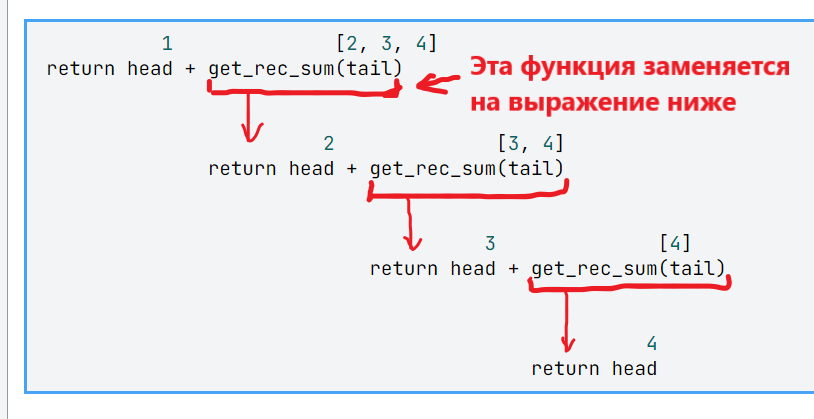
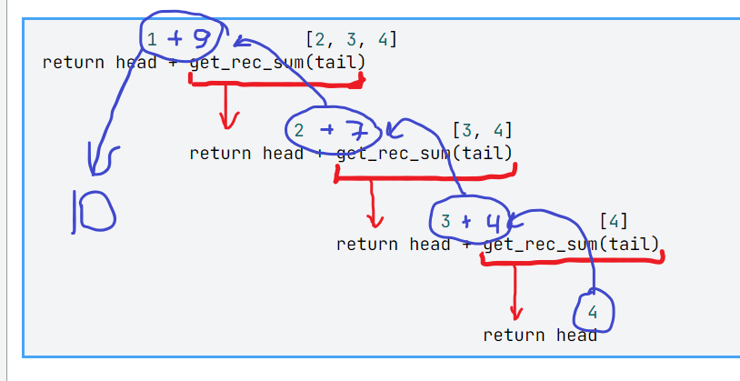

### Тимохин Евгений

```
lst1 = [int(i) for i in input().split()]

def get_rec_sum(lst):
    head, *tail = lst
    return head + get_rec_sum(tail) if tail else head

    print(get_rec_sum(lst1))
```
Возьмём список для примера: 

`[1, 2, 3, 4]`
Здесь происходит разделение списка на голову (число) и хвост 
(весь остальной список). 

`head, *tail = [1, 2, 3, 4] --> 1, [2, 3, 4]`
 Дальше в ретурне тернарник возвращает:

`head + get_rec_sum(tail)`
Пока хвост не станет `False`, то есть `[]`. Получаем следующее:



Последняя функция вернёт просто число, так как список `[4]` 
разделится на голову 4 и хвост `[]`.

То есть сработает вот это:

`if tail else head`
Дойдя до 'дна' рекурсия начнёт подниматься обратною Выделил 
синим. Смотреть нужно снизу вверх.



___
если рассматривать концептуальный алгоритм для этой задачи, без 
технической реализации, то получится следующее:

1. 'Отрываем' от списка первое число, до тех пор пока не останется 
пустой список.

2. Складываем 'оторванные' числа.

Вот аналог, через цикл `while`

```
lst = [1, 2, 3, 4, 5, 6]
summ = 0

while lst:
    head, *lst = lst
    summ += head

print(summ)
```


