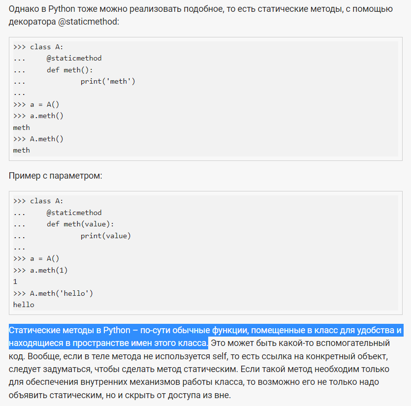

# Заметки по разделу

___В этом файле собраны все заметки по разделу___

Параметр `self` нужен для того, чтобы мы могли работать
с локальными атрибутами конкретного экземпляра класса

 **Что называется методом класса?**
* Любая (не статическая) функция, объявленная внутри класса

**Что называют атрибутами класса?**
* Переменные и имена методов (ссылки на методы) класса

**Какую роль играет параметр `self` в методах класса?**
* это ссылка на объект класса, из которого был вызван метод

Если нигде в коде атрибут не устанавливается, то атрибут будет
задан на уровне класса (если он имеется)

Атрибуты объекта записываются в объект, созданный при помощи класса.
Записываются они через ключевое слово `self`.
Атрибут класса принадлежит самому классу, а не объекту. Т.е., 
записываются в сам класс. И из объекта изменить атрибут класса
нельзя. Обычно, это служебные свойства, которые нужны самому
классу, а не будущим объектам

