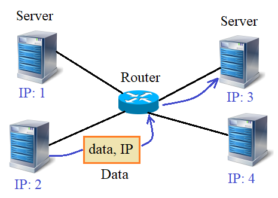

# 1.8 Испытание свойствами и методами

Испытание свойствами и методами
Видео-разбор (решение смотреть только после
своей попытки): [ссылка на YT видео](https://youtu.be/26pwwOu_-d0)

Время первого испытания. Представьте, что вы получили
задание от заказчика. Вас просят реализовать простую
имитацию локальной сети, состоящую из набора серверов,
соединенных между собой через роутер.



Каждый сервер может отправлять пакет любому другому
серверу сети. Для этого у каждого есть свой уникальный
IP-адрес. Для простоты - это просто целое (натуральное)
число от `1` и до `N`, где `N` - общее число серверов. Алгоритм
следующий. Предположим, сервер с z собирается отправить
пакет информации серверу с `IP = 3`. Для этого, он сначала
отправляет пакет роутеру, а уже тот, смотрит на IP-адрес
и пересылает пакет нужному узлу (серверу).

Для реализации этой схемы программе предлагается объявить три класса:

`Server` - для описания работы серверов в сети;\
`Router` - для описания работы роутеров в сети (в
данной задаче полагается один роутер);\
`Data` - для описания пакета информации.

Серверы будут создаваться командой:

`sv = Server()`
При этом, уникальный IP-адрес каждого сервера должен
формироваться автоматически при создании нового
экземпляра класса `Server`.

Далее, роутер должен создаваться аналогичной командой:

`router = Router()`
А, пакеты данных, командой:

`data = Data`(строка с данными, IP-адрес назначения)
Для формирования и функционирования локальной сети,
в классе `Router` должны быть реализованы следующие методы:

`link(server)` - для присоединения сервера `server` 
(объекта класса `Server`) к роутеру (для простоты, каждый 
сервер соединен только с одним роутером);\
`unlink(server)` - для отсоединения сервера `server` (объекта
класса `Server`) от роутера;\
`send_data()` - для отправки всех пакетов (объектов класса
`Data`) из буфера роутера соответствующим серверам (после 
отправки буфер должен очищаться).

И одно обязательное локальное свойство (могут быть и
другие свойства):

`buffer` - список для хранения принятых от серверов
пакетов (объектов класса `Data`).

Класс `Server` должен содержать свой набор методов:

`send_data(data)` - для отправки информационного
пакета `data` (объекта класса `Data`) с указанным IP-адресом 
получателя (пакет отправляется роутеру и сохраняется в
его буфере - локальном свойстве `buffer`);\
`get_data()` - возвращает список принятых пакетов (если
ничего принято не было, то возвращается пустой список)
и очищает входной буфер;\
`get_ip()` - возвращает свой IP-адрес.

Соответственно в объектах класса `Server` должны быть
локальные свойства:

`buffer` - список принятых пакетов (объекты класса
`Data`, изначально пустой);\
`ip` - IP-адрес текущего сервера.

Наконец, объекты класса `Data` должны содержать два
следующих локальных свойства:

`data` - передаваемые данные (строка);
`ip` - IP-адрес назначения.

Пример использования этих классов (эти строчки в 
программе писать не нужно):
```
router = Router()
sv_from = Server()
sv_from2 = Server()
router.link(sv_from)
router.link(sv_from2)
router.link(Server())
router.link(Server())
sv_to = Server()
router.link(sv_to)
sv_from.send_data(Data("Hello", sv_to.get_ip()))
sv_from2.send_data(Data("Hello", sv_to.get_ip()))
sv_to.send_data(Data("Hi", sv_from.get_ip()))
router.send_data()
msg_lst_from = sv_from.get_data()
msg_lst_to = sv_to.get_data()
```
Ваша задача реализовать классы `Router`, `Server` и
`Data` в соответствии с приведенным техническим 
заданием (ТЗ). Что-либо выводить на экран не нужно.

# Solutions

```

```
