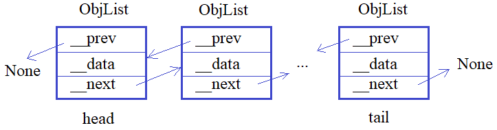

# 2.1 Режимы доступа public, private, protected. Сеттеры и геттеры

Видео-разбор подвига (решение смотреть только после
своей попытки): [ссылка на YT видео](https://youtu.be/YJiPpHVguyE)

Теория по двусвязным спискам (при 
необходимости): [ссылка на YT видео](https://youtu.be/0sTH9EwXT1I)

**Большой подвиг 9.** Необходимо реализовать связный
список (не список языка Python и не хранить объекты в
списке Python), когда объекты класса `ObjList` связаны
с соседними через приватные свойства `__next` и `__prev`:



Для этого объявите класс `LinkedList`, который будет
представлять связный список в целом и иметь набор 
следующих методов:

`add_obj(self, obj)` - добавление нового объекта
`obj` класса `ObjList` в конец связного списка;\
`remove_obj(self)` - удаление последнего объекта
из связного списка;\
`get_data(self)` - получение списка из строк 
локального свойства `__data` всех объектов связного списка.

И в каждом объекте этого класса должны создаваться
локальные публичные атрибуты:

`head` - ссылка на первый объект связного списка
(если список пустой, то `head = None`);\
`tail` - ссылка на последний объект связного
списка (если список пустой, то `tail = None`).

Объекты класса `ObjList` должны иметь следующий
набор приватных локальных свойств:

`__next` - ссылка на следующий объект связного
списка (если следующего объекта нет, то `__next = None`);\
`__prev` - ссылка на предыдущий объект связного списка
(если предыдущего объекта нет, то `__prev = None`);\
`__data` - строка с данными.

Также в классе `ObjList` должны быть реализованы
следующие сеттеры и геттеры:

`set_next(self, obj)` - изменение приватного 
свойства `__next` на значение `obj`;\
`set_prev(self, obj)` - изменение приватного
свойства `__prev` на значение `obj`;\
`get_next(self)` - получение значения приватного
свойства `__next`;\
`get_prev(self)` - получение значения приватного
свойства `__prev`;\
`set_data(self, data)` - изменение приватного 
свойства `__data` на значение `data`;\
`get_data(self)` - получение значения приватного 
свойства `__data`.

Создавать объекты класса `ObjList` предполагается
командой:

`ob = ObjList("данные 1")`
А использовать класс `LinkedList` следующим образом
(пример, эти строчки писать в программе не нужно):
```
lst = LinkedList()
lst.add_obj(ObjList("данные 1"))
lst.add_obj(ObjList("данные 2"))
lst.add_obj(ObjList("данные 3"))
res = lst.get_data()    # ['данные 1', 'данные 2', 'данные 3']
```
Объявите в программе классы `LinkedList` и `ObjList` в
соответствии с заданием.

P.S. На экран ничего выводить не нужно.

# Solution

```

```
