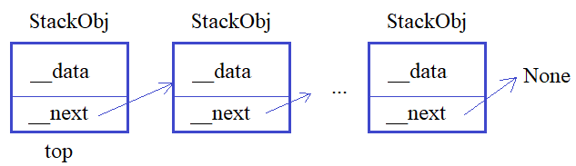

**2.2 Свойства property. Декоратор @property**

Видео-разбор подвига (решение смотреть только после
своей попытки): [ссылка на YT видео](https://youtu.be/mg4b8nhVDKY)

Теория по односвязным спискам (при
необходимости): [ссылка на YT видео](https://youtu.be/TrHAcHGIdgQ)

**Подвиг 6.** Реализуйте односвязный список
(не список Python, не использовать список Python
для хранения объектов), когда один объект ссылается
на следующий и так по цепочке до последнего:



Для этого объявите в программе два класса: 

`StackObj` - для описания объектов односвязного списка;\
`Stack` - для управления односвязным списком.

Объекты класса `StackObj` предполагается создавать командой:

`obj = StackObj(данные)`\
Здесь данные - это строка с некоторым содержимым.
Каждый объект класса `StackObj` должен иметь следующие
локальные приватные атрибуты:

`__data` - ссылка на строку с данными, указанными
при создании объекта;\
`__next` - ссылка на следующий объект класса
`StackObj` (при создании объекта принимает значение `None`).

Также в классе `StackObj` должны быть объявлены 
объекты-свойства:

`next` - для записи и считывания информации
из локального приватного свойства __next;\
`data` - для записи и считывания информации
из локального приватного свойства __data.

При записи необходимо реализовать проверку, 
что `__next` будет ссылаться на объект класса
`StackObj` или значение `None`. Если проверка
не проходит, то `__next` остается без изменений.

Класс `Stack` предполагается использовать
следующим образом:

`st = Stack() # создание объекта односвязного списка`\
В объектах класса `Stack` должен быть локальный
публичный атрибут:

`top` - ссылка на первый добавленный объект 
односвязного списка (если список пуст, то `top = None`).

А в самом классе `Stack` следующие методы:

`push(self, obj)` - добавление объекта класса `StackObj`
в конец односвязного списка;\
`pop(self)` - извлечение последнего объекта с его
удалением из односвязного списка;\
`get_data(self)` - получение списка из объектов односвязного
списка (список из строк локального атрибута `__data` каждого
объекта в порядке их добавления, или пустой список, если объектов нет).

Пример использования классов `Stack` и `StackObj` (эти строчки
в программе писать не нужно):
```
st = Stack()
st.push(StackObj("obj1"))
st.push(StackObj("obj2"))
st.push(StackObj("obj3"))
st.pop()
res = st.get_data()    # ['obj1', 'obj2']
```
P.S. В программе требуется объявить только классы. 
На экран ничего выводить не нужно. 

# Solution

```
class StackObj:
    def __init__(self, data: str):
        self.__data = data
        self.__next = None

    @property
    def next(self):
        return self.__next

    @next.setter
    def next(self, obj):
        if self.__check_next(obj):
            self.__next = obj

    @property
    def data(self):
        return self.__data

    @data.setter
    def data(self, data: str):
        if type(data) == str:
            self.__data = data

    @staticmethod
    def __check_next(value):
        return isinstance(value, StackObj | None)


class Stack:
    def __init__(self):
        self.top = None
        self.last = None

    def push(self, obj: StackObj):
        """
        При первом добавлении, last ссылается на новый объект.
        Если top is None, то top также ссылается на новый объект.
        При следующем добавлении идет проверка, если у last есть
        ссылка на объект, то у этого объекта вызывается сеттер, который
        перезаписывает локальный приватный атрибут next, теперь он
        ссылается на новый добавленный объект.
        После этого last ссылается уже на новый добавленный
        объект

        """
        if self.last:
            self.last.next = obj
        self.last = obj
        if self.top is None:
            self.top = obj

    def pop(self):
        """
        Чтобы удалить эк из односвязного списка, нужно
        у предыдущего эк удалить ссылку на удаляемый эк
        p.s. пометки для себя, если буду перечитывать код:
        переменная t создается, чтобы не перезаписывать
        локальное свойство. result создает новую ссылку
        на свойство эк, что позволяет одновременно
        перезаписать и вернуть значение
        """
        if self.last:
            last = self.last
            t = self.top
            if t != last:
                while t.next != last:
                    t = t.next
                else:
                    result = t.next
                    t.next = None
                    self.last = t
                    return result
            else:
                result = self.top
                self.top = None
                self.last = None
                return result

    def get_data(self):
        if self.top:
            top = self.top
            lst = [top.data]
            while top != self.last:
                lst.append(top.next.data)
                top = top.next
            return lst

        return []
```
