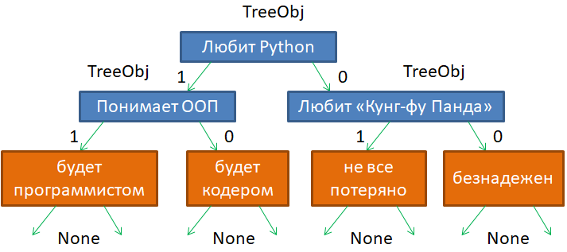
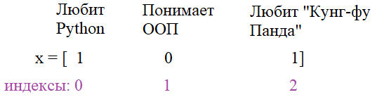

**2.2 Свойства property. Декоратор @property**

Видео-разбор подвига (решение смотреть только после
своей попытки): [ссылка на YT видео](https://youtu.be/5Y9qT5grunw)

**Большой подвиг 8.** Требуется реализовать программу
по работе с решающими деревьями:



Здесь в каждом узле дерева делается проверка
(задается вопрос). Если проверка проходит, 
то осуществляется переход к следующему объекту 
по левой стрелке (с единицей), а иначе - по правой
стрелке (с нулем). И так до тех пор, пока не дойдем
до одного из листа дерева (вершины без потомков).

В качестве входных данных используется вектор 
(список) с бинарными значениями: 1 - да, 0 - нет.
Каждый элемент этого списка соответствует своему
вопросу (своей вершине дерева), например:



Далее, этот вектор применяется к решающему дереву,
следующим образом. Корневая вершина "Любит Python"
с ней связан первый элемент вектора `x` и содержит
значение `1`, следовательно, мы переходим по левой 
ветви. Попадаем в вершину "Понимает ООП". С ней
связан второй элемент вектора x со значением 0,
следовательно, мы переходим по правой ветви и 
попадаем в вершину "будет кодером". Так как эта
вершина конечная (листовая), то получаем результат
в виде строки "будет кодером". По аналогии выполняется
обработка вектора `x` с другими наборами значений `0` и `1`.

Для реализации решающих деревьев в программе следует
объявить два класса:

`TreeObj` - для описания вершин и листьев решающего дерева;\
`DecisionTree` - для работы с решающим деревом в целом.

В классе `DecisionTree` должны быть реализованы
(по крайне мере) два метода уровня класса (`@classmethod`):

`def predict(cls, root, x)` - для построения прогноза
(прохода по решающему дереву) для вектора `x` из 
корневого узла дерева `root`.\
`def add_obj(cls, obj, node=None, left=True)` - для
добавления вершин в решающее дерево (метод должен
возвращать добавленную вершину - объект класса `TreeObj`);

В методе `add_obj` параметры имеют, следующие значения:

`obj` - ссылка на новый (добавляемый) объект
решающего дерева (объект класса `TreeObj`);\
`node` - ссылка на объект дерева, к которому
присоединяется вершина `obj`;
`left` - флаг, определяющий ветвь дерева (объекта
`node`), к которой присоединяется объект `obj`
(`True` - к левой ветви; `False` - к правой).

В классе `TreeObj` следует объявить инициализатор:

def __init__(self, indx, value=None):` ...
`
где `indx` - проверяемый в вершине дерева индекс
вектора `x`;\
`value` - значение, хранящееся в вершине
(принимает значение `None` для вершин, у которых есть
потомки - промежуточных вершин).

При этом, в каждом создаваемом объекте класса 
`TreeObj` должны автоматически появляться следующие
локальные атрибуты:

`indx` - проверяемый индекс (целое число);\
`value` - значение с данными (строка);\
`__left` - ссылка на следующий объект дерева по 
левой ветви (изначально `None`);\
`__right` - ссылка на следующий объект дерева
по правой ветви (изначально `None`).

Для работы с локальными приватными атрибутами
`__left` и `__right` необходимо объявить
объекты-свойства с именами `left` и `right`.

Эти классы в дальнейшем предполагается использовать
следующим образом (эти строчки в программе не писать):
```
root = DecisionTree.add_obj(TreeObj(0))
v_11 = DecisionTree.add_obj(TreeObj(1), root)
v_12 = DecisionTree.add_obj(TreeObj(2), root, False)
DecisionTree.add_obj(TreeObj(-1, "будет программистом"), v_11)
DecisionTree.add_obj(TreeObj(-1, "будет кодером"), v_11, False)
DecisionTree.add_obj(TreeObj(-1, "не все потеряно"), v_12)
DecisionTree.add_obj(TreeObj(-1, "безнадежен"), v_12, False)

x = [1, 1, 0]
res = DecisionTree.predict(root, x) # будет программистом
```
P.S. В программе требуется объявить только классы. На экран ничего выводить не нужно. 

# Solution

```
class TreeObj:
    def __init__(self, indx, value=None):
        self.index = indx
        self.value = value
        self.left = self.right = None

    @property
    def left(self):
        return self.__left

    @left.setter
    def left(self, obj):
        self.__left = obj

    @property
    def right(self):
        return self.__right

    @right.setter
    def right(self, obj):
        self.__right = obj


class DecisionTree:
    root = None

    @classmethod
    def predict(cls, root: 'DecisionTree', x: list[int]):
        obj = root
        while obj:
            obj_next = cls.get_next(obj, x)
            if obj_next is None:
                break
            obj = obj_next
        return obj.value

    @classmethod
    def add_obj(cls, obj: TreeObj, node: 'DecisionTree' = None, left=True):
        """

        :param obj: reference to the newly added object
        :param node: a reference to the tree object to which node obj is attached
        :param left: flag that defines the branch of the tree to which the object is attached
        :return:
        """
        if node:
            if left:
                node.left = obj
            else:
                node.right = obj

        return obj

    @classmethod
    def get_next(cls, obj, x):
        if x[obj.index] == 1:
            return obj.left
        return obj.right
```
