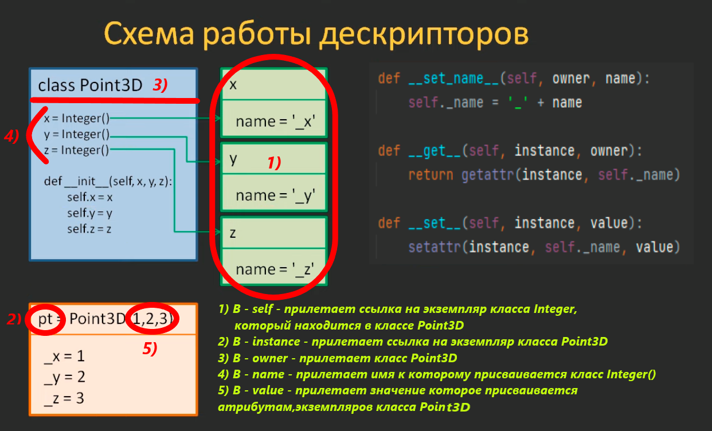

___
**Что из себя представляют дескрипторы?**

- это любой класс, в котором объявлены специальные методы __get__, __set__ и/или __del__
- это любой класс, в котором объявлен специальный метод __get__
- это любой класс, в котором объявлены специальные методы __get__ и __set__
___
**Чем дескрипторы концептуально отличаются от объектов-свойств (property)?**

- один класс дескриптора способен заменить множество однотипных объектов-свойств
- в одном классе дескриптора можно единожды описать логику взаимодействия с внутренними (приватными или защищенными) переменными
___
**Какие виды дескрипторов существуют?**

- дескриптор не данных (non-data descriptor), когда в классе присутствует метод __get__, но отсутствует метод __set__
- дескриптор данных (data descriptor), когда в классе присутствуют методы __get__ и __set__
___
**В программе объявлен дескриптор RealValue и класс Point:**
```
class RealValue:
    def __set_name__(self, owner, name):
        self.name = "_" + name

    def __get__(self, instance, owner):
        return instance.__dict__[self.name]


class Point:
    x = RealValue()
    y = RealValue()

    def __init__(self, x, y):
        self.x = x
        self.y = y
А, затем, выполняются команды:

pt = Point(1.5, 2.3)
pt.__dict__['x'] = 10.0
print(pt.x)
```
Какое значение будет выведено в консоль и почему?

- Будет выведено 10.0, так как RealValue - это дескриптор не данных и в инициализаторе будут созданы локальные свойства x, y. Затем, в строчке pt.x идет обращение к локальному свойству x со значением 10.
___
**В программе объявлен дескриптор StringField и класс DataBase:**
```
class StringField:
    def __set_name__(self, owner, name):
        self.name = "_" + name

    def __get__(self, instance, owner):
        return instance.__dict__[self.name]

    def __set__(self, instance, value):
        instance.__dict__[self.name] = value


class DataBase:
    x = StringField()
    y = StringField()

    def __init__(self, x, y):
        self.x = x
        self.y = y
А, затем, выполняются команды:

db = DataBase('hi', 'low')
db.__dict__['x'] = 'top'
print(db.x)
```
Какое значение будет выведено в консоль и почему?

- Будет выведено 'hi', так как StringField - это дескриптор данных и он имеет наибольший приоритет при обращении к атрибутам, поэтому в строчке db.x будет обращение к дескриптору, а не к локальному свойству.
