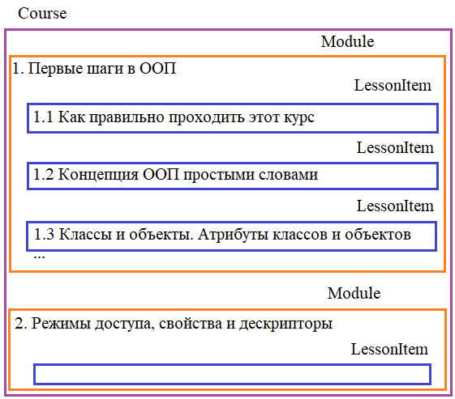

3.1 Методы __setattr__, __getattribute__, __getattr__ и __delattr__
1 из 11 шагов пройден
0 из 27 баллов  получено
Видео-разбор подвига (решение смотреть только после своей попытки): https://youtu.be/7b8d5zqiiAM

Подвиг 5. Необходимо создать программу для обучающего курса. Для этого объявляются три класса:

Course - класс, отвечающий за управление курсом в целом;
Module - класс, описывающий один модуль (раздел) курса;
LessonItem - класс одного занятия (урока).

Структура курса на уровне этих классов, приведена на рисунке ниже:

Объекты класса LessonItem должны создаваться командой:

lesson = LessonItem(название урока, число практических занятий, общая длительность урока)
Соответственно, в каждом объекте класса LessonItem должны создаваться локальные атрибуты:

title - название урока (строка);
practices - число практических занятий (целое положительное число);
duration - общая длительность урока (целое положительное число).

Необходимо с помощью магических методов реализовать следующую логику взаимодействия с объектами класса LessonItem:

1. Проверять тип присваиваемых данных локальным атрибутам. Если типы не соответствуют требованиям, то генерировать исключение командой:

raise TypeError("Неверный тип присваиваемых данных.")
2. При обращении к несуществующим атрибутам объектов класса LessonItem возвращать значение False.
3. Запретить удаление атрибутов title, practices и duration в объектах класса LessonItem.

Объекты класса Module должны создаваться командой:

module = Module(название модуля)
Каждый объект класса Module должен содержать локальные атрибуты:

name - название модуля;
lessons - список из уроков (объектов класса LessonItem), входящих в модуль (изначально список пуст).

Также в классе Module должны быть реализованы методы:

add_lesson(self, lesson) - добавление в модуль (в конец списка lessons) нового урока (объекта класса LessonItem);
remove_lesson(self, indx) - удаление урока по индексу в списке lessons.

Наконец, объекты класса Course создаются командой:

course = Course(название курса)
И содержат следующие локальные атрибуты:

name - название курса (строка);
modules - список модулей в курсе (изначально список пуст).

Также в классе Course должны присутствовать следующие методы:

add_module(self, module) - добавление нового модуля в конце списка modules;
remove_module(self, indx) - удаление модуля из списка modules по индексу в этом списке.

Пример использования классов (в программе эти строчки не писать):

course = Course("Python ООП")
module_1 = Module("Часть первая")
module_1.add_lesson(LessonItem("Урок 1", 7, 1000))
module_1.add_lesson(LessonItem("Урок 2", 10, 1200))
module_1.add_lesson(LessonItem("Урок 3", 5, 800))
course.add_module(module_1)
module_2 = Module("Часть вторая")
module_2.add_lesson(LessonItem("Урок 1", 7, 1000))
module_2.add_lesson(LessonItem("Урок 2", 10, 1200))
course.add_module(module_2)
P.S. На экран ничего выводить не нужно. 
