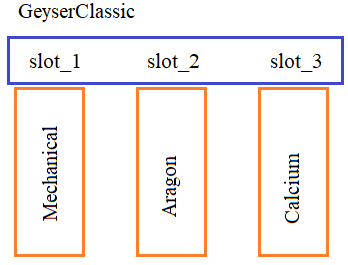

**3.1 Методы __setattr__, __getattribute__, __getattr__ и __delattr__**

Видео-разбор подвига (решение смотреть только после
своей попытки): [ссылка на YT видео](https://youtu.be/FaHqn8Yr45o)

**Подвиг 10.** Объявите класс `GeyserClassic` - фильтр
для очистки воды. В этом классе должно быть три слота
для фильтров. Каждый слот строго для своего класса фильтра:

`Mechanical` - для очистки от крупных механических частиц;\
`Aragon` - для последующей очистки воды;\
`Calcium` - для обработки воды на третьем этапе.



Объекты классов фильтров должны создаваться командами:
```
filter_1 = Mechanical(дата установки)
filter_2 = Aragon(дата установки)
filter_3 = Calcium(дата установки)
```
Во всех объектах этих классов должен 
формироваться локальный атрибут:

`date` - дата установки фильтров (для 
простоты - положительное вещественное число).

Также нужно запретить изменение этого атрибута после
создания объектов этих классов (только чтение). В случае
присвоения нового значения, прежнее значение не менять. 
Ошибок никаких не генерировать.

Объекты класса `GeyserClassic` должны создаваться командой:

`g = GeyserClassic()`\
А сам класс иметь атрибут:

`MAX_DATE_FILTER = 100` - максимальное время работы
фильтра (любого)

и следующие методы:

`add_filter(self, slot_num, filter)` - добавление
фильтра `filter` в указанный слот `slot_num` (номер 
слота: 1, 2 и 3), если он (слот) пустой (без фильтра).
Также здесь следует проверять, что в первый слот можно
установить только объекты класса `Mechanical`, во 
второй - объекты класса Aragon и в третий - объекты
класса `Calcium`. Иначе слот должен оставаться пустым.

`remove_filter(self, slot_num)` - извлечение фильтра из
указанного слота (slot_num: 1, 2, и 3);

`get_filters(self)` - возвращает кортеж из набора трех
фильтров в порядке их установки (по возрастанию номеров
слотов);

`water_on(self)` - включение воды: возвращает `True`,
если вода течет и `False` - в противном случае.

Метод `water_on()` должен возвращать значение `True` 
при выполнении следующих условий:

- все три фильтра установлены в слотах;
- все фильтры работают в пределах срока службы (значение
(time.time() - date) должно быть в пределах `[0; MAX_DATE_FILTER]`)

Пример использования классов  (эти строчки в программе
писать не нужно):
```
my_water = GeyserClassic()
my_water.add_filter(1, Mechanical(time.time()))
my_water.add_filter(2, Aragon(time.time()))
w = my_water.water_on() # False
my_water.add_filter(3, Calcium(time.time()))
w = my_water.water_on() # True
f1, f2, f3 = my_water.get_filters()  # f1, f2, f3 - ссылки на соответствующие объекты классов фильтров
my_water.add_filter(3, Calcium(time.time())) # повторное добавление в занятый слот невозможно
my_water.add_filter(2, Calcium(time.time())) # добавление в "чужой" слот также невозможно
```
P.S. На экран ничего выводить не нужно. 

# Solution

```

```
