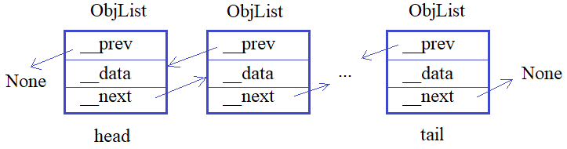

**3.3 Методы __str__, __repr__, __len__, __abs__**

Видео-разбор подвига (решение смотреть только
после своей попытки): https://youtu.be/6-xKuQp9b7Y

Теория по двусвязным спискам (при
необходимости): https://youtu.be/0sTH9EwXT1I

**Подвиг 5.** Объявите класс `LinkedList`
(связный список) для работы со следующей структурой данных:



Здесь создается список из связанных между
собой объектов класса `ObjList`. Объекты
этого класса создаются командой:

`obj = ObjList(data)`\
где data - строка с некоторой информацией.
Также в каждом объекте obj класса `ObjList`
должны создаваться следующие локальные атрибуты:

`__data` - ссылка на строку с данными;\
`__prev` - ссылка на предыдущий объект 
связного списка (если объекта нет, то `__prev = None`);\
`__next` - ссылка на следующий объект
связного списка (если объекта нет, то `__next = None`).

В свою очередь, объекты класса `LinkedList`
должны создаваться командой:

`linked_lst = LinkedList()`\
и содержать локальные атрибуты:

`head` - ссылка на первый объект связного
списка (если список пуст, то `head = None`);\
`tail` - ссылка на последний объект связного
списка (если список пуст, то `tail = None`).

А сам класс содержать следующие методы:

`add_obj(obj)` - добавление нового объекта 
`obj` класса `ObjList` в конец связного списка;\
`remove_obj(indx)` - удаление объекта класса 
`ObjList` из связного списка по его порядковому
номеру (индексу); индекс отсчитывается с нуля.

Также с объектами класса `LinkedList` должны
поддерживаться следующие операции:

`len(linked_lst)` - возвращает число объектов
в связном списке;\
`linked_lst(indx)` - возвращает строку `__data`,
хранящуюся в объекте класса `ObjList`,
расположенного под индексом `indx` (в связном списке).

Пример использования классов (эти строчки в программе писать не нужно):
```
linked_lst = LinkedList()
linked_lst.add_obj(ObjList("Sergey"))
linked_lst.add_obj(ObjList("Balakirev"))
linked_lst.add_obj(ObjList("Python"))
linked_lst.remove_obj(2)
linked_lst.add_obj(ObjList("Python ООП"))
n = len(linked_lst)  # n = 3
s = linked_lst(1) # s = Balakirev
```
P.S. На экран в программе ничего выводить не нужно. 

# Solution

```

```
