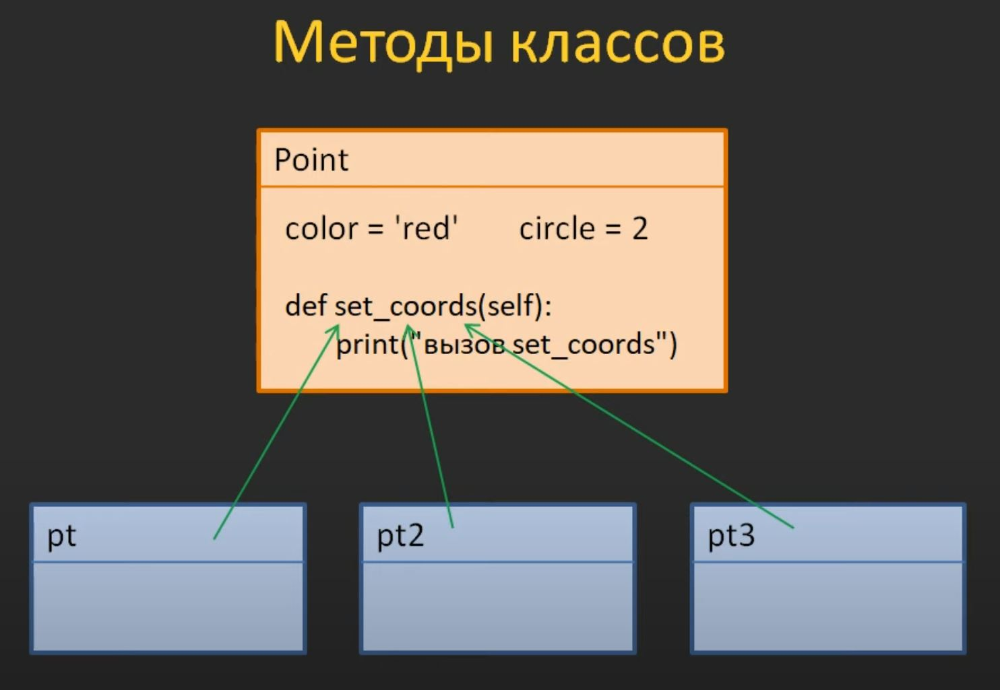
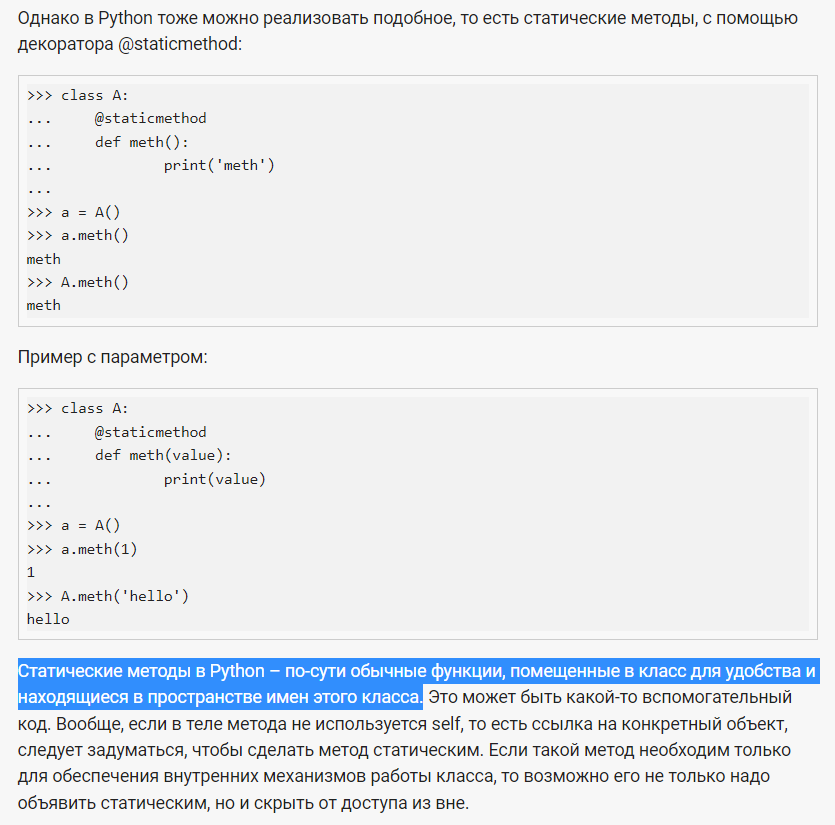

# Заметки по разделу

___В этом файле собраны все заметки по разделу___

Параметр `self` нужен для того, чтобы мы могли работать
с локальными атрибутами конкретного экземпляра класса

 **Что называется методом класса?**
* Любая (не статическая) функция, объявленная внутри класса

**Что называют атрибутами класса?**
* Переменные и имена методов (ссылки на методы) класса

**Какую роль играет параметр `self` в методах класса?**
* это ссылка на объект класса, из которого был вызван метод

