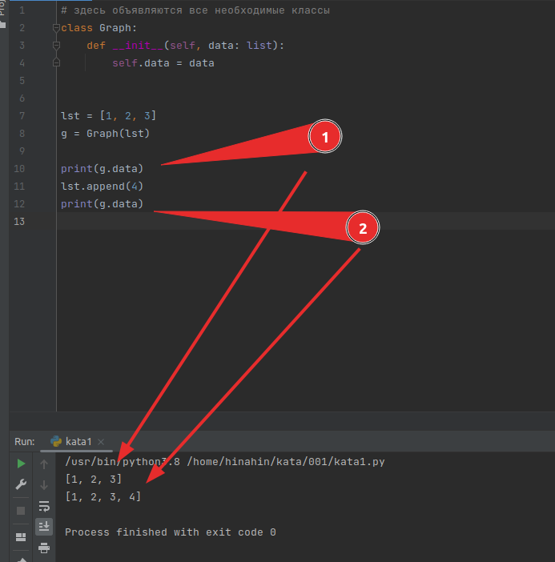

### Даниил Митрофанов

в Python в каждой переменной храниться ссылка на объект
в памяти, а не сам объект. Поэтому когда мы передаем 
аргумент `data_graph` в `Graph(data_graph)`,то мы передаем
ссылку на список data_graph, а  не сам список. Тобишь
в "волшебной" функции `__init__` во время инициализации
переменной  `self.data = data` Мы передали атрибуту ссылку,
а не новый список. Из-за чего если мы захотим изменить
локальный атрибут в одном объекте, то у нас измениться 
список `data_graph` , в месте с ним, если у нас их несколько,
все локальные атрибуты  `self.data` во всех объектах класса. 

А если мы создадим копию `self.data = data[:]`  или
`self.data =data.copy()` (втрое предпочтительной по PEP8),
то выделиться новая память под новый список  и локальный 
атрибут уже будет ссылаться на новую ячейку памяти. Таким
образом мы можем спокойно его изменять и никак не касаться 
списка  `data_graph` и других локальных атрибутов `data`

### Антон Черников

тут все дело в том, что список - это изменяемый объект.
И если его передать в качестве аргумента и сохранить 
в локальный атрибут не копию, а его самого, то дальше 
начинаются проблемы.

Посмотрите на скриншот ниже. Я передал в локальный 
атрибут сам список, а не его копию. Затем в оригинальный
список добавляю элемент, но в объекте класса тоже этот
элемент попадает. Поэтому лучше всегда в таких случаях
делать копию.

