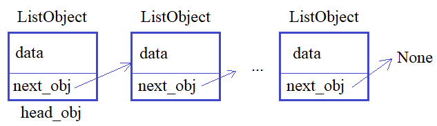

1.5 Инициализатор __init__ и финализатор __del__

Видео-разбор подвига (решение смотреть только
после своей попытки): https://youtu.be/3WfWCBKRKIM[ссылка на YT видео](здесь вставляется сама ссылка)

Теория по односвязным спискам (при необходимости): https://youtu.be/TrHAcHGIdgQ

Подвиг 9. Вам необходимо реализовать односвязный список (не список языка Python, объекты в списке не хранить, а формировать связанную структуру, показанную на рисунке) из объектов класса ListObject:

Для этого объявите в программе класс ListObject, объекты которого создаются командой:

obj = ListObject(data)
Каждый объект класса ListObject должен содержать локальные свойства:

next_obj - ссылка на следующий присоединенный объект (если следующего объекта нет, то next_obj = None);
data - данные объекта в виде строки.

В самом классе ListObject должен быть объявлен метод:

link(self, obj) - для присоединения объекта obj такого же класса к текущему объекту self (то есть, атрибут next_obj объекта self должен ссылаться на obj).

Прочитайте список строк из входного потока командой:

lst_in = list(map(str.strip, sys.stdin.readlines()))
Затем сформируйте односвязный список, в объектах которых (в атрибуте data) хранятся строки из списка lst_in (первая строка в первом объекте, вторая - во втором и  т.д.). На первый добавленный объект класса ListObject должна ссылаться переменная head_obj.

P.S. В программе что-либо выводить на экран не нужно.

Sample Input:

1. Первые шаги в ООП
1.1 Как правильно проходить этот курс
1.2 Концепция ООП простыми словами
1.3 Классы и объекты. Атрибуты классов и объектов
1.4 Методы классов. Параметр self
1.5 Инициализатор init и финализатор del
1.6 Магический метод new. Пример паттерна Singleton
1.7 Методы класса (classmethod) и статические методы (staticmethod)
Sample Output:
