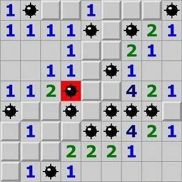

1.5 Инициализатор __init__ и финализатор __del__
6 из 11 шагов пройдено
11 из 29 баллов  получено
Видео-разбор подвига (решение смотреть только
после своей попытки): https://youtu.be/gmjwMakXk0c[ссылка на YT видео](здесь вставляется сама ссылка)

Большой подвиг 10. Объявите два класса: 

Cell - для представления клетки игрового поля;
GamePole - для управления игровым полем, размером N x N клеток.

С помощью класса Cell предполагается создавать отдельные клетки командой:

c1 = Cell(around_mines, mine)
Здесь around_mines - число мин вокруг данной клетки поля; mine - булева величина (True/False), означающая наличие мины в текущей клетке. При этом, в каждом объекте класса Cell должны создаваться локальные свойства:

around_mines - число мин вокруг клетки (начальное значение 0);
mine - наличие мины в текущей клетке (True/False);
fl_open - открыта/закрыта клетка - булево значение (True/False). Изначально все клетки закрыты (False).

С помощью класса GamePole должна быть возможность создавать квадратное игровое поле с числом клеток N x N:

pole_game = GamePole(N, M)
Здесь N - размер поля; M - общее число мин на поле. При этом, каждая клетка представляется объектом класса Cell и все объекты хранятся в двумерном списке N x N элементов - локальном свойстве pole объекта класса GamePole. 

В классе GamePole должны быть также реализованы следующие методы:

init() - инициализация поля с новой расстановкой M мин (случайным образом по игровому полю, разумеется каждая мина должна находиться в отдельной клетке).
show() - отображение поля в консоли в виде таблицы чисел открытых клеток (если клетка не открыта, то отображается символ #).

При создании экземпляра класса GamePole в его инициализаторе следует вызывать метод init() для первоначальной инициализации игрового поля.

В классе GamePole могут быть и другие вспомогательные методы.

Создайте экземпляр pole_game класса GamePole с размером поля N = 10 и числом мин M = 12. 

P.S. На экран в программе ничего выводить не нужно.
