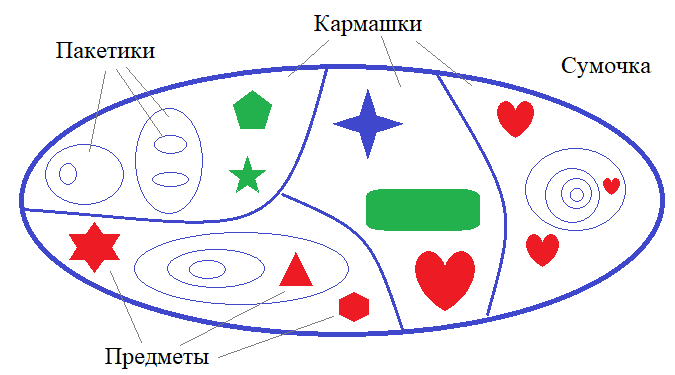
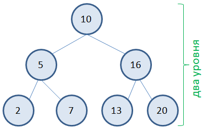

**Выберите правильный вариант упрощения записи Big O 
(О большого) записанного в виде:**
```
O(A+n+n^2)
```
**где A - константа; n - переменная.**
- O(n^2)
___
**Имеется программа на языке Python:**
```
lst = [0] * n   # список из n нулей
for i in range(n):
    lst[i] = i % 5

for i in range(n):
    for j in range(m):
        lst[i] += lst[j]
```
**Здесь n, m - некоторые переменные с натуральными
числами (целые больше нуля), причем m < n. Какова
вычислительная сложность программы с позиции Big O?**
- O(n * m)
___
**Имеется программа на языке Python:**
```
size = n if n > m else m  # размер списка
lst = [0] * size   # список из size нулей

for i in range(size):
    lst[i] = i % 5
```

**Здесь n, m - некоторые переменные с натуральными числами
(целые больше нуля). Какова вычислительная сложность программы
с позиции Big O?**
- O(n), если n >= m
- O(m), если m >= n
___
**Выберите правильный вариант упрощения записи Big O (О большого) записанного в виде:**
```
O(log(n) + 2^n + n^2 + n)
```
**где n - переменная.**
- O(2^n)
___
**Вы выбираете для себя курс по программированию по k критериям. 
Например, критерии:**
```
курс должен выдавать сертификат;
оценка по отзывам должна быть выше 4.5;
число практических задач больше 50.
```
**Сначала все курсы фильтруются по первому критерию (в нашем 
примере наличие сертификата). Затем, к отобранным применяется
второй критерий. К оставшимся - третий и т.д. для всех k критериев.
Какова вычислительная сложность этого алгоритма с позиции О большого?**
- O(k)
___
**Ваша девушка (или, если вы девушка, то сами) попросила вас найти 
в ее сумке флэшку. Вы смотрите в сумку и видите там все разложено 
по кармашкам, а в кармашках все по пакетикам, а в тех пакетиках 
могут быть другие пакетики и т.д.**



**Флэшка может находиться где угодно. Вы выстраиваете следующий алгоритм
поиска. Последовательно проверяете все кармашки на наличие в них 
флэшки. Если не находите, то также последовательно перебираете все
пакеты первого уровня вложенности. Затем, второго, третьего, n-го,
до тех пор, пока либо не найдется флэшка, либо не будут просмотрены
все пакеты.**\
**Оцените сложность этого алгоритма с точки зрения О большого если 
суммарное число отсеков и пакетиков в сумке равно N (N - переменная
величина), а время проверки наличия флэшки в каждом отсеке или пакетике
фиксированное и составляет t секунд.**
- O(N)
___
**Имеется сбалансированное бинарное дерево с n вершинами (n - переменная
величина), сформированное по правилу: если числовое значение меньше
значения в вершине, то оно добавляется в левое поддерево, а иначе - в
правое. На рисунке ниже представлен пример такого бинарного дерева:**



**Для таких деревьев реализован алгоритм поиска некоторого значения x.
Поиск начинается с корня (самой верхней вершины дерева). Если x не
равен значению в вершине, то при x меньше, чем значение в вершине, 
поиск продолжаем в левом поддереве, иначе - в правом. Так как каждое
поддерево - это такое же полноценное бинарное дерево, то для них 
процедура поиска полностью повторяется пока либо не найдется заданное 
значение x, либо не дойдем до листовой вершины (у которой нет потомков).**

**Оцените сложность этого алгоритма с точки зрения О большого.**
- O(log n)
___
**Имеется следующая программа на языке Python:**
```
for i in range(n):
    for j in range(i, n):
        print(i, j)
```
**Какова вычислительная сложность этой программы с позиции Big O?**
- O(n^2)
___
**Имеется следующая программа на языке Python, вычисляющая произведение
двух квадратных матриц A и B размерностью n x n и результат
сохраняется в третью матрицу C также размерами n x n:**
```
for i in range(n):
    for j in range(n):
        s = 0
        for k in range(n):
            s += A[i][k] * B[k][j]
        C[i][j] = s
```
**Какова вычислительная сложность этой программы с позиции Big O?**
- O(n^3)
___
**Вы решили взломать (подобрать) пароль, состоящий из k символов.
Каждый символ пароля может принимать одно из 72 значений:**
```
a-z, A-Z, 0-9, $#@!_%^&*~
```
**Алгоритм подбора перебирает все возможные варианты из k символов.
Какова вычислительная сложность этого алгоритма с точки зрения Big O?**
- O(73^k)
___
**Имеется запись выражения для Big O в виде:**
```
O(A + B^2 + 2^C)
```
**При этом ничего неизвестно про выражения A, B, C. 
Выберите правильный вариант упрощения этой записи для О большого.**
- нельзя упростить
___
**Расположите функции в порядке возрастания их сложности с увеличением
аргумента x.**
- f(x) = 1
- f(x) = log(x)
- f(x) = x
- f(x) = x*log(x)
- f(x) = x^2
- f(x) = 2^x
- f(x) = x!
