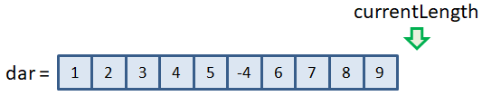

**Выберите все верные утверждения для динамического массива.**
- общее число элементов в динамическом массиве характеризуется 
его физическим размером
- число записанных в динамический массив данных соответствует
его логическому размеру
- операция доступа к произвольному элементу динамического массива
выполняется за O(1) операций
- динамический массив реализуется на основе обычных статических
массивов
- динамический массив увеличивает свой размер по мере заполнения
его данными
___
**Отметьте все задачи, где целесообразно использовать динамический,
а не статический массив.**
- хранение значений функции f(x) при постоянном увеличении x
- хранение записей по максимальному числу подтягиваний на
каждом занятии физкультуры
- хранение блока принимаемых данных по сети Интернет
___
**Пусть имеется следующий заполненный динамический массив:**

**В программе производится добавление нового значения в этот массив.
Какие действия при этом будут выполнены?**
- создается новый массив с увеличенным размером; в него копируются 
данные из прежнего массива; заносится значение в новый массив
___
**Каков объем вычислений с позиции О большого (Big O) при добавлении
нового элемента в конец динамического массива длиной n элементов?**
- O(1)
___
**Каков объем вычислений с позиции О большого (Big O) при добавлении
нового элемента в начало динамического массива длиной n элементов?**
- O(n)
___
**Каждый элемент динамического массива состоит из 2 байт. Физический
размер динамического массива 10 элементов, а логический размер 5 
элементов. Сколько байт занимает непрерывная область памяти,
отведенная под этот динамический массив?**
- 20
___
**Предположим, что в процессе вставки очередного значения динамический
массив увеличил свой размер в два раза. После этого выполняется
операция удаления только что вставленного значения. Что в этом 
случае произойдет с размером динамического массива?**
- размер не изменится
___
**Каков объем вычислений с позиции О большого (Big O) при удалении
элемента с конца динамического массива длиной n элементов?**
- O(1)
___
**Каков объем вычислений с позиции О большого (Big O) при удалении
элемента в произвольной позиции динамического массива длиной n 
элементов?**
- O(n)
